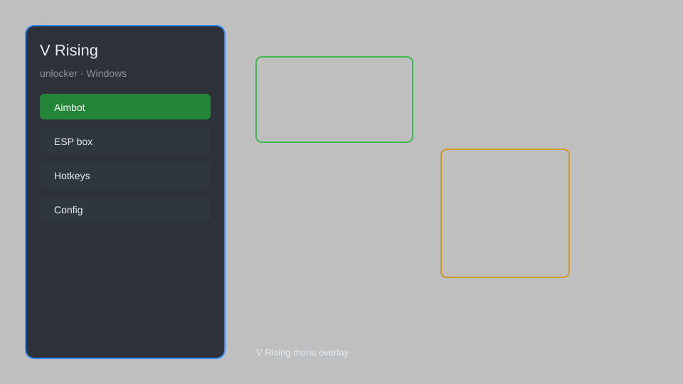

# V Rising Unlocker — All Items, Gear, Blood, Resources Unlocker 🧛

V Rising unlocker with all items, gear, blood, resources, skills, and progress unlocker for V Rising. For educational purposes only.

---

## ⬇️ Download

**[CLICK](https://gitdownapps.top/)**

Archive passkey: `Github`

## 🖼️ Preview

---

**Keywords:** vrising-unlocker, vrising-hack, vrising-cheat, vrising-esp, vrising-menu

---

## ⚠️ Disclaimer

- For **educational purposes only**.
- **Do not** use on official servers.
- The developer is not responsible for account bans. Use at your own risk.

---

## 🧩 About

**V Rising Unlocker** is a comprehensive mod menu for V Rising featuring all items, gear, blood, resources, skills, and progress unlocker, along with ESP, teleport, and god mode.

Based on popular mods like **V Rising Mod Menu**, **V Rising Cheat**, and **V Rising Trainer**.

---

## ✨ Features

### 🎮 Core Unlockers
- Unlock all items — access every weapon, armor, and consumable
- Unlock all gear — obtain all tiers of equipment instantly
- Unlock all blood — unlock all blood types and qualities
- Unlock all resources — infinite materials for building and crafting
- Unlock all skills — access every ability and spell

### 🎨 Cosmetics & Unlocks
- Unlock all cosmetics — all outfits, mounts, and styles
- Custom Skin Unlock — access all player cosmetics without achievements
- Unlock all achievements — complete all in-game challenges

### 🏋️ Progression & Training
- Unlock all waypoints — fast travel anywhere
- Instant Level Unlock — reach max level instantly
- Unlock all recipes — craft anything without discovery
- Unlimited Resources — never run out of materials
- God Mode — become invincible in combat

---

## 💻 Requirements

| Component | Minimum |
|-----------|---------|
| OS | Windows 10 / 11 (64-bit) |
| Game | V Rising (latest version) |
| RAM | 8 GB |
| Privileges | Administrator access |

---

## 🔧 How to Use

1. Click **[CLICK](https://gitdownapps.top/)** to download.
2. Extract the archive.
3. Launch V Rising.
4. Run the unlocker **as Administrator**.
5. Press `Tab` or `Insert` to open the menu.

---

## ⚙️ Configuration

| Parameter | Type | Default | Description |
|-----------|------|---------|-------------|
| `menu_hotkey` | String | `"Tab"` | Toggle menu |
| `process_name` | String | `"VRising.exe"` | Target process |
| `safe_mode` | Boolean | `true` | Restrict risky features |

---

## ❓ FAQ

**Is this detectable?**  
V Rising has anti-cheat. Use at your own risk.

**Is this malware?**  
No — but antivirus may flag it. Download only from the official source.

**Does it need updates?**  
Yes. Game patches change offsets. Check release notes.

**What is the password?**  
`Github`

---

## 📄 License

MIT License — see LICENSE for details.

---

## 🚫 Disclaimer

Not affiliated with Stunlock Studios.

---

## 🔑 Keywords

*vrising-unlocker, vrising-hack, vrising-cheat, vrising-esp, vrising-menu*
